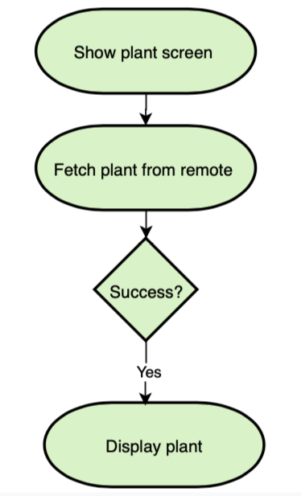

# BotanicalGarden App Case Study

## Plant Feature Specs

### Story: User requests to see the plant

### Narrative #1

```
As an online user
I want the app to automatically load the plant
So I can always enjoy the information of the plant
```

#### Scenarios

```
Given the user has connectivity
 When the user requests to see the plant
 Then the app should display the plant from remote
```

## Use Cases

### Load Plant From Remote Use Case

#### Data:
- URLRequest

#### Primary course (happy path):
1. Execute "Load Plant" with above data.
2. System downloads data from the URLRequest.
3. System validates downloaded data.
4. System creates plant from valid data.
5. System delivers plant.

#### Invalid data – error course (sad path):
1. System delivers invalid data error.

#### No connectivity – error course (sad path):
1. System delivers connectivity error.

---

## Flowchart



## Model Specs

### Plant

| Property      | Type     |
|---------------|----------|
| `F_Name_Ch`   | `String` |
| `F_Location`  | `String` |
| `F_Feature`   | `String` |
| `F_Pic01_URL` | `String` |

### Payload contract

```
GET / plant

200 RESPONSE

{
    "result": {
        "results": [
            {
                "F_Name_Ch": "九芎",
                "F_Location": "臺灣動物區；蟲蟲探索谷；熱帶雨林區；鳥園；兩棲爬蟲動物館",
                "F_Feature": "紅褐色的樹皮剝落後呈灰白色，樹幹光滑堅硬。葉有極短的柄，長橢圓形或卵形，全綠，葉片兩端尖，秋冬轉紅。夏季6～8月開花，花冠白色，花數甚多而密生於枝端，花為圓錐花序頂生，花瓣有長柄，邊緣皺曲像衣裙的花邊花絲長短不一。果實為蒴果，橢圓形約6-8公厘，種子有翅。",
                "F_Pic01_URL": "http://www.zoo.gov.tw/iTAP/04_Plant/Lythraceae/subcostata/subcostata_1.jpg"
            },
            ...
        ]
    }
}
```

---

## App Architecture


